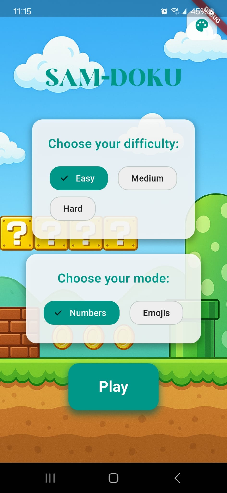
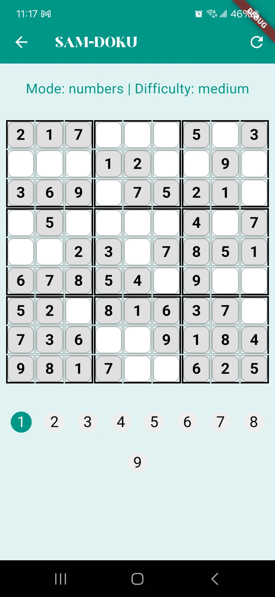
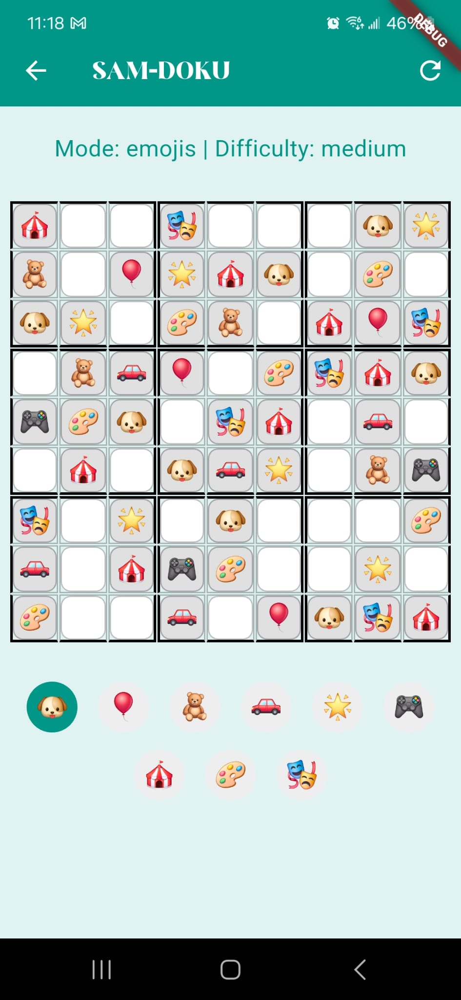
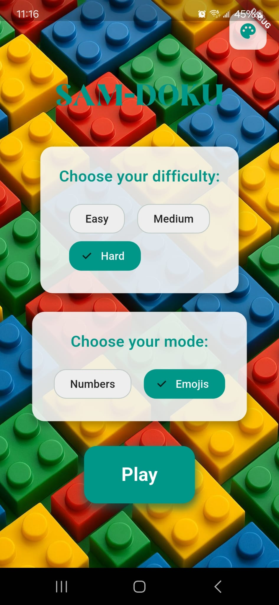
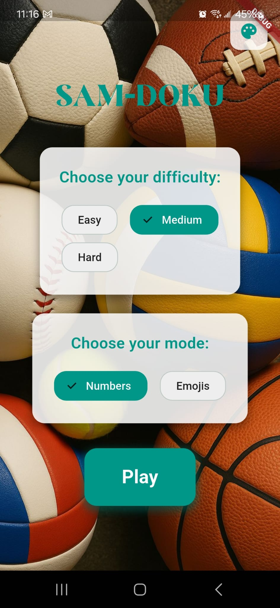

# Sudoku Samuel

A modern and fun Sudoku app developed with Flutter, featuring different difficulty levels and game modes. This project was created for my 7-year-old son who loves solving Sudoku puzzles. The app includes child-friendly features like emoji mode and colorful themes to make the game more engaging for young players.

## 🎮 Features

- **Multiple Difficulty Levels**
  - Easy (4x4)
  - Medium (9x9)
  - Hard (16x16)

- **Game Modes**
  - Numbers Mode: Traditional Sudoku with numbers
  - Emojis Mode: Fun Sudoku with emojis

- **Customizable Themes**
  - Super Mario Background
  - Lego Background
  - Balls Background

- **Modern Interface**
  - Material Design 3
  - UI for mobile
  - Smooth animations

## 🛠️ Technologies Used

- **Flutter** - UI Framework
- **Riverpod** - State Management
- **Material Design 3** - Design System
- **Dart** - Programming Language

## 📱 Screenshots


*Home screen with difficulty and game mode selection*


*Game screen with interactive board*


*Game screen with interactive board using emojis*




## 📦 Project Structure

```
lib/
├── main.dart
├── screens/
│   ├── home_screen.dart
│   └── game_screen.dart
├── widgets/
│   ├── choice_chips.dart
│   └── white_container.dart
├── providers/
│   ├── game_settings_provider.dart
│   └── background_theme_provider.dart
└── services/
    └── sudoku_generator.dart
```